<h1 align="center" id="title"> 

🚀 [Technodaya NIT AP](https://technodaya.netlify.app/)
</h1>

<p align="center"></p>

<p id="description">The main objective of technodaya was to reduce time and efforts of magazine editors now it provides great accessibility to professors and students to share their recent work/achivements and the Admin (editorial team) will verify and generate magazines</p>

<h2>🚀 Demo</h2>

Live website here : [https://technodaya.netlify.app/](https://technodaya.netlify.app/)

  
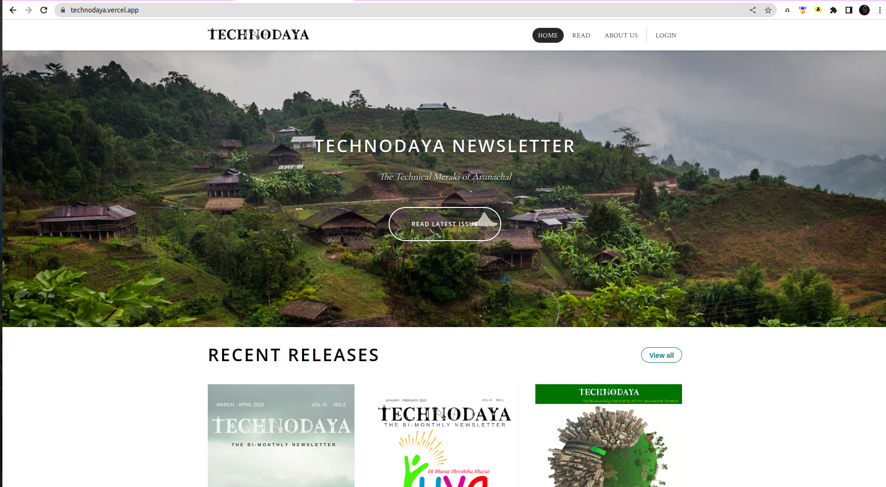
  
<details>

<summary> <h2>Project Screenshorts: </h2>
</summary>

<h3>The landing page before sign in:</h3>


<h3>Login Page </h3>
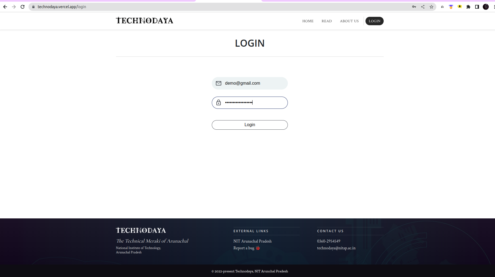

<h3>After Sign in </h3>
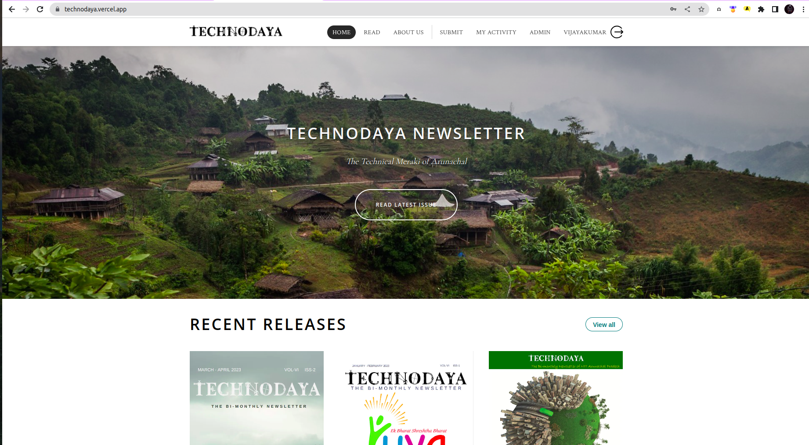

<h3>Read Section </h3>
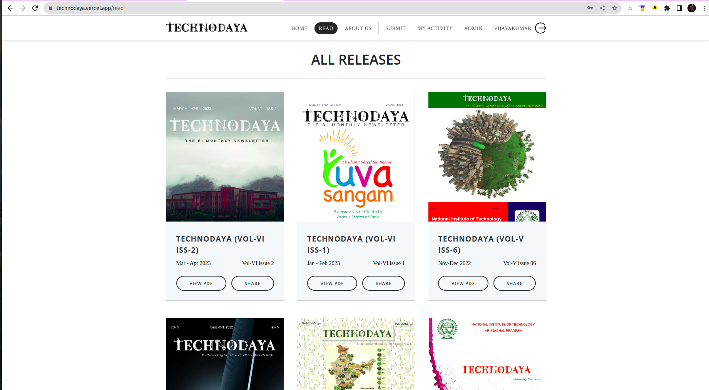

<h3>Submit Activity Section </h3>
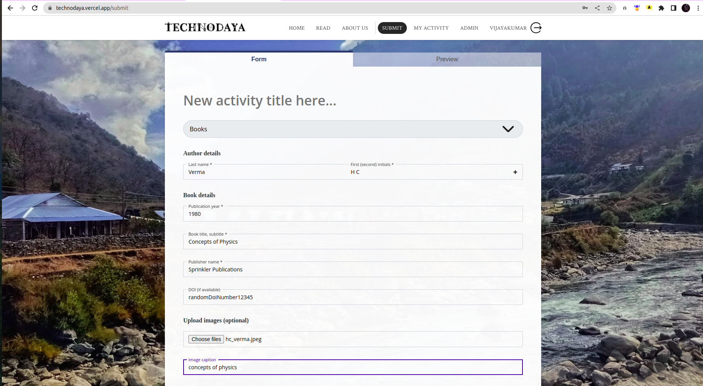

<h3>Preview Activity Section </h3>
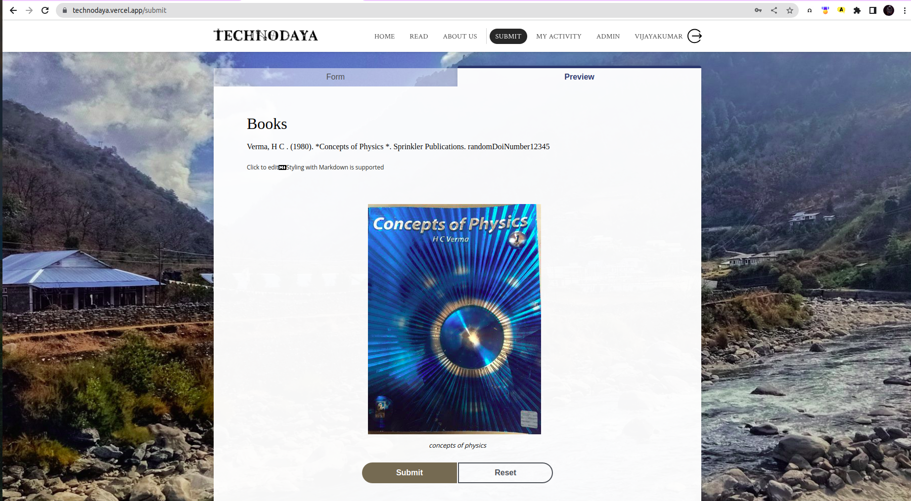

<h3>Manage and verify activity </h3>
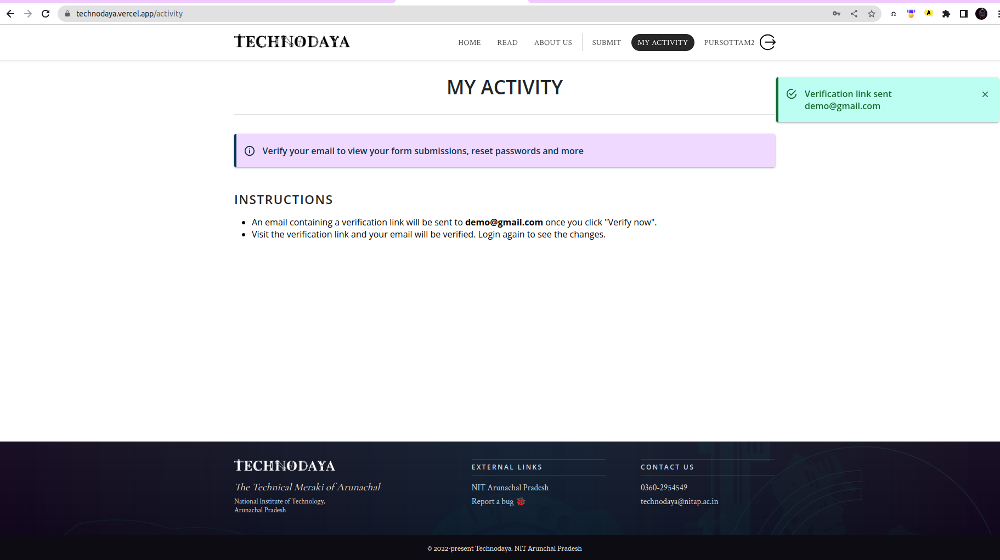


<h3>Admin Submission Querries </h3>
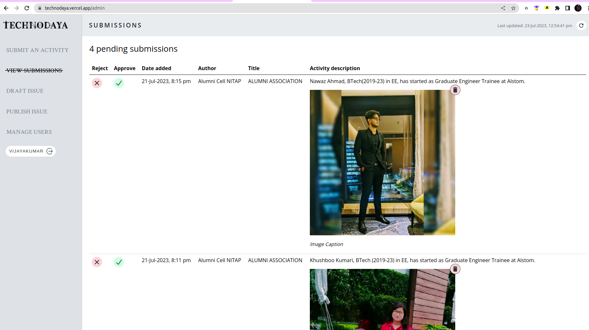

<h3>Verify as admin </h3>
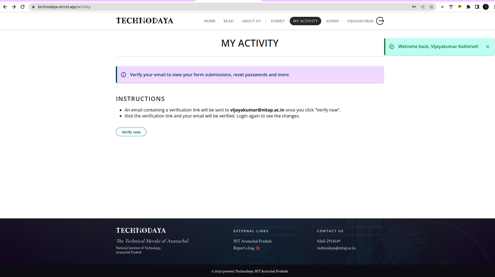


<h3>Draft an Issue </h3>
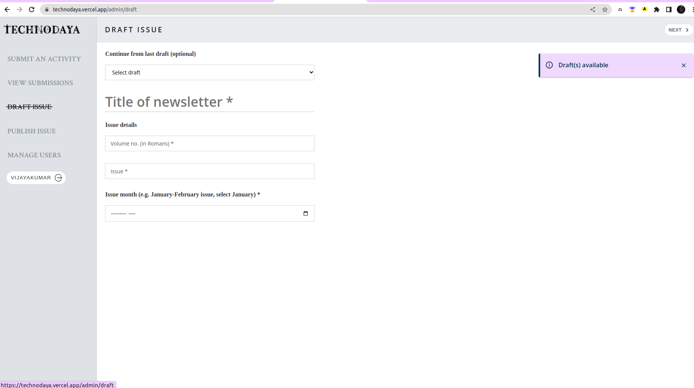

<h3>Publish an Issue </h3>
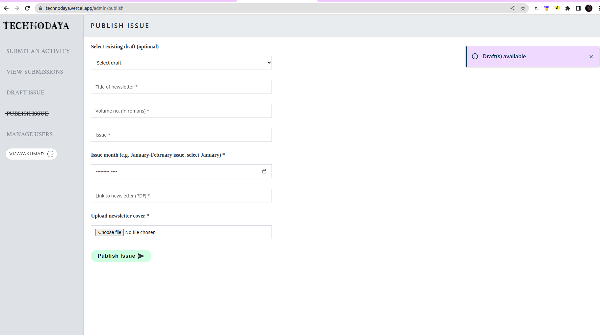

<h3>Footer</h3>
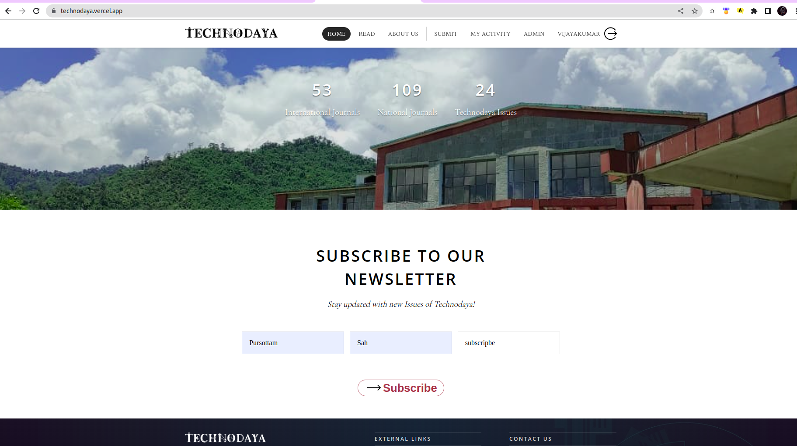
</details>
<h2>🧐 Features</h2>

Here're some of the project's best features:

*   Reduces paper workload of editors
*   Easy content collection
*   Save time and efforts of users
*   Secure and consistent magazine data
*   Reduces  official mail traffic
*   Better help and support for authors

<h2>🛠️ Installation Steps:</h2>

<p>1. Clone the respository</p>

```
git clone "https://github.com/Pursottam6003/Designathon-for-one"
```

<p>2. Install node dependencies</p>

```
npm i 
```

<p>3. create a new branch</p>

```
git branch -m  newBranchName
```

<p>4. Switch to new branch</p>

```
git switch newBranchName
```

<p>5. Start the server</p>

```
npm start
```

<h2>🍰 Contribution Guidelines:</h2>

Please fork the repository first and feel free to create genuine issues and pull requests.

  
  
<h2>💻 Built with</h2>

Technologies used in the project:

*   ReactJs
*   NodeJs
*   NextJs
*   SCSS
*   Firebase

<h2>🛡️ License:</h2>

This project is licensed under the MIT License

<h2>💖Like my work?</h2>

For any technical issues mail us at technodaya@nitap.ac.in<p>technodaya.nitap.ac.in</p>